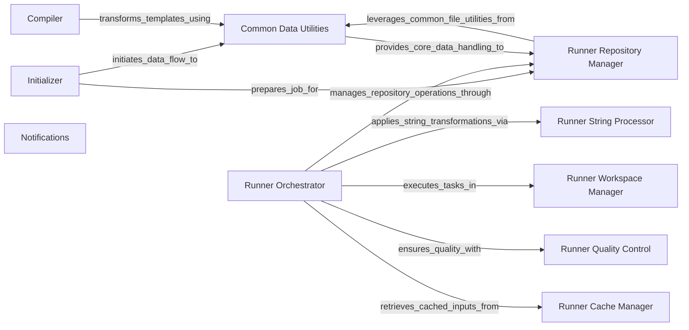

## Component Details

This system, BayerCLAW, provides a robust framework for orchestrating and executing jobs. It handles the initial launch process from S3, compiles job templates, manages data manipulation and repository interactions, and facilitates notifications for workflow state changes. The runner component orchestrates the execution flow, including string substitutions, workspace management, caching, and quality control checks, ensuring efficient and reliable job processing.

### Initializer
This component is responsible for handling the initial S3 launch process. It reads job data from S3, performs substitutions, checks for recursive launches, copies job data to the repository, and writes extended job data back to S3.

**Related Classes/Methods**:

- <a href="https://github.com/Bayer-Group/BayerCLAW/blob/master/lambda/src/initializer/initializer.py#L79-L113" target="_blank" rel="noopener noreferrer">`BayerCLAW.lambda.src.initializer.initializer:handle_s3_launch` (79:113)</a>
- <a href="https://github.com/Bayer-Group/BayerCLAW/blob/master/lambda/src/initializer/initializer.py#L19-L30" target="_blank" rel="noopener noreferrer">`BayerCLAW.lambda.src.initializer.initializer.read_s3_object` (19:30)</a>
- <a href="https://github.com/Bayer-Group/BayerCLAW/blob/master/lambda/src/initializer/initializer.py#L42-L45" target="_blank" rel="noopener noreferrer">`BayerCLAW.lambda.src.initializer.initializer.substitute_job_data` (42:45)</a>
- <a href="https://github.com/Bayer-Group/BayerCLAW/blob/master/lambda/src/initializer/initializer.py#L48-L53" target="_blank" rel="noopener noreferrer">`BayerCLAW.lambda.src.initializer.initializer.check_recursive_launch` (48:53)</a>
- <a href="https://github.com/Bayer-Group/BayerCLAW/blob/master/lambda/src/initializer/initializer.py#L56-L63" target="_blank" rel="noopener noreferrer">`BayerCLAW.lambda.src.initializer.initializer.copy_job_data_to_repo` (56:63)</a>
- <a href="https://github.com/Bayer-Group/BayerCLAW/blob/master/lambda/src/initializer/initializer.py#L66-L76" target="_blank" rel="noopener noreferrer">`BayerCLAW.lambda.src.initializer.initializer.write_extended_job_data_object` (66:76)</a>

### Compiler
The Compiler component is responsible for compiling templates, including handling state machine resources, capitalizing top-level keys, and substituting parameters. It also manages state machine versions and aliases.

**Related Classes/Methods**:

- <a href="https://github.com/Bayer-Group/BayerCLAW/blob/master/lambda/src/compiler/pkg/compiler.py#L17-L61" target="_blank" rel="noopener noreferrer">`BayerCLAW.lambda.src.compiler.pkg.compiler:compile_template` (17:61)</a>
- <a href="https://github.com/Bayer-Group/BayerCLAW/blob/master/lambda/src/compiler/pkg/compiler.py#L12-L14" target="_blank" rel="noopener noreferrer">`BayerCLAW.lambda.src.compiler.pkg.compiler._capitalize_top_level_keys` (12:14)</a>
- <a href="https://github.com/Bayer-Group/BayerCLAW/blob/master/lambda/src/compiler/pkg/util.py#L57-L66" target="_blank" rel="noopener noreferrer">`BayerCLAW.lambda.src.compiler.pkg.util.substitute_params` (57:66)</a>
- <a href="https://github.com/Bayer-Group/BayerCLAW/blob/master/lambda/src/compiler/pkg/state_machine_resources.py#L175-L210" target="_blank" rel="noopener noreferrer">`BayerCLAW.lambda.src.compiler.pkg.state_machine_resources.handle_state_machine` (175:210)</a>
- <a href="https://github.com/Bayer-Group/BayerCLAW/blob/master/lambda/src/compiler/pkg/state_machine_resources.py#L243-L254" target="_blank" rel="noopener noreferrer">`BayerCLAW.lambda.src.compiler.pkg.state_machine_resources.add_definition_substitutions` (243:254)</a>
- <a href="https://github.com/Bayer-Group/BayerCLAW/blob/master/lambda/src/compiler/pkg/state_machine_resources.py#L213-L224" target="_blank" rel="noopener noreferrer">`BayerCLAW.lambda.src.compiler.pkg.state_machine_resources.state_machine_version_rc` (213:224)</a>
- <a href="https://github.com/Bayer-Group/BayerCLAW/blob/master/lambda/src/compiler/pkg/state_machine_resources.py#L227-L240" target="_blank" rel="noopener noreferrer">`BayerCLAW.lambda.src.compiler.pkg.state_machine_resources.state_machine_alias_rc` (227:240)</a>

### Common Data Utilities
This component provides shared utility functions for data manipulation, including substituting job data into strings and filenames, and selecting file contents from various formats like JSON, YAML, and CSV. It also includes repository utility functions for managing S3 files.

**Related Classes/Methods**:

- <a href="https://github.com/Bayer-Group/BayerCLAW/blob/master/lambda/src/common/python/substitutions.py#L24-L39" target="_blank" rel="noopener noreferrer">`BayerCLAW.lambda.src.common.python.substitutions:substitute_job_data` (24:39)</a>
- <a href="https://github.com/Bayer-Group/BayerCLAW/blob/master/lambda/src/common/python/substitutions.py#L42-L59" target="_blank" rel="noopener noreferrer">`BayerCLAW.lambda.src.common.python.substitutions:substitute_into_filenames` (42:59)</a>
- <a href="https://github.com/Bayer-Group/BayerCLAW/blob/master/lambda/src/common/python/repo_utils.py#L65-L67" target="_blank" rel="noopener noreferrer">`BayerCLAW.lambda.src.common.python.repo_utils.Repo:from_uri` (65:67)</a>
- <a href="https://github.com/Bayer-Group/BayerCLAW/blob/master/lambda/src/common/python/repo_utils.py#L81-L86" target="_blank" rel="noopener noreferrer">`BayerCLAW.lambda.src.common.python.repo_utils.Repo:qualify` (81:86)</a>
- <a href="https://github.com/Bayer-Group/BayerCLAW/blob/master/lambda/src/common/python/repo_utils.py#L88-L90" target="_blank" rel="noopener noreferrer">`BayerCLAW.lambda.src.common.python.repo_utils.Repo:sub_repo` (88:90)</a>
- <a href="https://github.com/Bayer-Group/BayerCLAW/blob/master/lambda/src/common/python/repo_utils.py#L18-L24" target="_blank" rel="noopener noreferrer">`BayerCLAW.lambda.src.common.python.repo_utils.S3File` (18:24)</a>
- <a href="https://github.com/Bayer-Group/BayerCLAW/blob/master/lambda/src/common/python/file_select.py#L49-L78" target="_blank" rel="noopener noreferrer">`BayerCLAW.lambda.src.common.python.file_select:select_file_contents` (49:78)</a>
- <a href="https://github.com/Bayer-Group/BayerCLAW/blob/master/lambda/src/common/python/file_select.py#L37-L39" target="_blank" rel="noopener noreferrer">`BayerCLAW.lambda.src.common.python.file_select.slurp` (37:39)</a>
- <a href="https://github.com/Bayer-Group/BayerCLAW/blob/master/lambda/src/common/python/file_select.py#L16-L18" target="_blank" rel="noopener noreferrer">`BayerCLAW.lambda.src.common.python.file_select.read_json` (16:18)</a>
- <a href="https://github.com/Bayer-Group/BayerCLAW/blob/master/lambda/src/common/python/file_select.py#L21-L23" target="_blank" rel="noopener noreferrer">`BayerCLAW.lambda.src.common.python.file_select.read_json_lines` (21:23)</a>
- <a href="https://github.com/Bayer-Group/BayerCLAW/blob/master/lambda/src/common/python/file_select.py#L26-L28" target="_blank" rel="noopener noreferrer">`BayerCLAW.lambda.src.common.python.file_select.read_yaml` (26:28)</a>
- <a href="https://github.com/Bayer-Group/BayerCLAW/blob/master/lambda/src/common/python/file_select.py#L31-L34" target="_blank" rel="noopener noreferrer">`BayerCLAW.lambda.src.common.python.file_select.read_csv` (31:34)</a>
- <a href="https://github.com/Bayer-Group/BayerCLAW/blob/master/lambda/src/common/python/file_select.py#L42-L46" target="_blank" rel="noopener noreferrer">`BayerCLAW.lambda.src.common.python.file_select.stringify` (42:46)</a>

### Notifications
This component is responsible for generating and sending notification messages, specifically for state changes, by creating message attributes and SNS payloads.

**Related Classes/Methods**:

- <a href="https://github.com/Bayer-Group/BayerCLAW/blob/master/lambda/src/notifications/notifications.py#L102-L116" target="_blank" rel="noopener noreferrer">`BayerCLAW.lambda.src.notifications.notifications:lambda_handler` (102:116)</a>
- <a href="https://github.com/Bayer-Group/BayerCLAW/blob/master/lambda/src/notifications/notifications.py#L56-L86" target="_blank" rel="noopener noreferrer">`BayerCLAW.lambda.src.notifications.notifications.make_message_attributes` (56:86)</a>
- <a href="https://github.com/Bayer-Group/BayerCLAW/blob/master/lambda/src/notifications/notifications.py#L12-L53" target="_blank" rel="noopener noreferrer">`BayerCLAW.lambda.src.notifications.notifications.make_state_change_message` (12:53)</a>
- <a href="https://github.com/Bayer-Group/BayerCLAW/blob/master/lambda/src/notifications/notifications.py#L89-L99" target="_blank" rel="noopener noreferrer">`BayerCLAW.lambda.src.notifications.notifications.make_sns_payload` (89:99)</a>

### Runner Orchestrator
This is the main entry point for the BayerCLAW runner. It orchestrates the entire execution flow, including repository interactions, string substitutions, workspace management, caching, input/output handling, and quality control checks.

**Related Classes/Methods**:

- <a href="https://github.com/Bayer-Group/BayerCLAW/blob/master/bclaw_runner/src/runner/runner_main.py#L43-L116" target="_blank" rel="noopener noreferrer">`BayerCLAW.bclaw_runner.src.runner.runner_main:main` (43:116)</a>

### Runner Repository Manager
This component manages all repository-related operations for the runner. It handles checking for previous runs, verifying file existence, clearing run status, reading job data, downloading inputs, and uploading outputs to the repository.

**Related Classes/Methods**:

- <a href="https://github.com/Bayer-Group/BayerCLAW/blob/master/bclaw_runner/src/runner/repo.py#L50-L241" target="_blank" rel="noopener noreferrer">`BayerCLAW.bclaw_runner.src.runner.repo.Repository` (50:241)</a>
- <a href="https://github.com/Bayer-Group/BayerCLAW/blob/master/bclaw_runner/src/runner/repo.py#L210-L223" target="_blank" rel="noopener noreferrer">`BayerCLAW.bclaw_runner.src.runner.repo.Repository.check_for_previous_run` (210:223)</a>
- <a href="https://github.com/Bayer-Group/BayerCLAW/blob/master/bclaw_runner/src/runner/repo.py#L89-L111" target="_blank" rel="noopener noreferrer">`BayerCLAW.bclaw_runner.src.runner.repo.Repository.check_files_exist` (89:111)</a>
- <a href="https://github.com/Bayer-Group/BayerCLAW/blob/master/bclaw_runner/src/runner/repo.py#L225-L231" target="_blank" rel="noopener noreferrer">`BayerCLAW.bclaw_runner.src.runner.repo.Repository.clear_run_status` (225:231)</a>
- <a href="https://github.com/Bayer-Group/BayerCLAW/blob/master/bclaw_runner/src/runner/repo.py#L65-L71" target="_blank" rel="noopener noreferrer">`BayerCLAW.bclaw_runner.src.runner.repo.Repository.read_job_data` (65:71)</a>
- <a href="https://github.com/Bayer-Group/BayerCLAW/blob/master/bclaw_runner/src/runner/repo.py#L151-L158" target="_blank" rel="noopener noreferrer">`BayerCLAW.bclaw_runner.src.runner.repo.Repository.download_inputs` (151:158)</a>
- <a href="https://github.com/Bayer-Group/BayerCLAW/blob/master/bclaw_runner/src/runner/repo.py#L203-L208" target="_blank" rel="noopener noreferrer">`BayerCLAW.bclaw_runner.src.runner.repo.Repository.upload_outputs` (203:208)</a>
- <a href="https://github.com/Bayer-Group/BayerCLAW/blob/master/bclaw_runner/src/runner/repo.py#L233-L241" target="_blank" rel="noopener noreferrer">`BayerCLAW.bclaw_runner.src.runner.repo.Repository.put_run_status` (233:241)</a>
- <a href="https://github.com/Bayer-Group/BayerCLAW/blob/master/bclaw_runner/src/runner/repo.py#L114-L129" target="_blank" rel="noopener noreferrer">`BayerCLAW.bclaw_runner.src.runner.repo.Repository._inputerator` (114:129)</a>
- <a href="https://github.com/Bayer-Group/BayerCLAW/blob/master/bclaw_runner/src/runner/repo.py#L171-L201" target="_blank" rel="noopener noreferrer">`BayerCLAW.bclaw_runner.src.runner.repo.Repository._upload_that` (171:201)</a>
- <a href="https://github.com/Bayer-Group/BayerCLAW/blob/master/bclaw_runner/src/runner/repo.py#L27-L29" target="_blank" rel="noopener noreferrer">`BayerCLAW.bclaw_runner.src.runner.repo._is_glob` (27:29)</a>
- `BayerCLAW.bclaw_runner.src.runner.repo._s3_file_exists` (full file reference)
- <a href="https://github.com/Bayer-Group/BayerCLAW/blob/master/bclaw_runner/src/runner/repo.py#L32-L47" target="_blank" rel="noopener noreferrer">`BayerCLAW.bclaw_runner.src.runner.repo._expand_s3_glob` (32:47)</a>
- <a href="https://github.com/Bayer-Group/BayerCLAW/blob/master/bclaw_runner/src/runner/repo.py#L18-L19" target="_blank" rel="noopener noreferrer">`BayerCLAW.bclaw_runner.src.runner.repo.SkipExecution` (18:19)</a>
- <a href="https://github.com/Bayer-Group/BayerCLAW/blob/master/bclaw_runner/src/runner/repo.py#L22-L24" target="_blank" rel="noopener noreferrer">`BayerCLAW.bclaw_runner.src.runner.repo._file_metadata` (22:24)</a>

### Runner String Processor
This component is dedicated to performing various string substitutions required by the runner, including general substitutions and specific image tag substitutions.

**Related Classes/Methods**:

- <a href="https://github.com/Bayer-Group/BayerCLAW/blob/master/bclaw_runner/src/runner/string_subs.py#L16-L27" target="_blank" rel="noopener noreferrer">`BayerCLAW.bclaw_runner.src.runner.string_subs:substitute` (16:27)</a>
- <a href="https://github.com/Bayer-Group/BayerCLAW/blob/master/bclaw_runner/src/runner/string_subs.py#L30-L39" target="_blank" rel="noopener noreferrer">`BayerCLAW.bclaw_runner.src.runner.string_subs.substitute_image_tag` (30:39)</a>

### Runner Quality Control
This component is responsible for performing quality control checks during the runner's execution. It can also trigger an abortion of the execution if checks fail.

**Related Classes/Methods**:

- <a href="https://github.com/Bayer-Group/BayerCLAW/blob/master/bclaw_runner/src/runner/qc_check.py#L58-L66" target="_blank" rel="noopener noreferrer">`BayerCLAW.bclaw_runner.src.runner.qc_check.do_checks` (58:66)</a>
- <a href="https://github.com/Bayer-Group/BayerCLAW/blob/master/bclaw_runner/src/runner/qc_check.py#L17-L34" target="_blank" rel="noopener noreferrer">`BayerCLAW.bclaw_runner.src.runner.qc_check.abort_execution` (17:34)</a>

### Runner Workspace Manager
This component manages the runner's local workspace. It handles writing job data files and executing commands within the workspace environment.

**Related Classes/Methods**:

- <a href="https://github.com/Bayer-Group/BayerCLAW/blob/master/bclaw_runner/src/runner/workspace.py#L21-L35" target="_blank" rel="noopener noreferrer">`BayerCLAW.bclaw_runner.src.runner.workspace.workspace` (21:35)</a>
- <a href="https://github.com/Bayer-Group/BayerCLAW/blob/master/bclaw_runner/src/runner/workspace.py#L38-L41" target="_blank" rel="noopener noreferrer">`BayerCLAW.bclaw_runner.src.runner.workspace.write_job_data_file` (38:41)</a>
- <a href="https://github.com/Bayer-Group/BayerCLAW/blob/master/bclaw_runner/src/runner/workspace.py#L44-L69" target="_blank" rel="noopener noreferrer">`BayerCLAW.bclaw_runner.src.runner.workspace.run_commands` (44:69)</a>

### Runner Cache Manager
This component is responsible for managing the caching of reference inputs for the runner, optimizing data retrieval.

**Related Classes/Methods**:

- <a href="https://github.com/Bayer-Group/BayerCLAW/blob/master/bclaw_runner/src/runner/cache.py#L68-L82" target="_blank" rel="noopener noreferrer">`BayerCLAW.bclaw_runner.src.runner.cache.get_reference_inputs` (68:82)</a>

### [FAQ](https://github.com/CodeBoarding/GeneratedOnBoardings/tree/main?tab=readme-ov-file#faq)