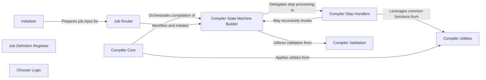

## Component Details

The Job Orchestration & Workflow Definition component is responsible for the initial setup, routing, and comprehensive compilation of high-level workflow definitions into executable AWS Step Functions state machine language. This includes handling various step types such as batch, scatter-gather, parallel, sub-pipeline, native, and chooser steps, along with their validation. It acts as the central hub for transforming abstract job specifications into concrete, executable workflows.

### Initializer
This component is responsible for the initial setup of a job execution. It reads job data from S3, performs variable substitutions, ensures no recursive launches, copies job data to a designated repository, and writes extended job data for subsequent steps. It acts as the entry point for S3-triggered workflows.

**Related Classes/Methods**:

- <a href="https://github.com/Bayer-Group/BayerCLAW/blob/master/lambda/src/initializer/initializer.py#L79-L113" target="_blank" rel="noopener noreferrer">`BayerCLAW.lambda.src.initializer.initializer:handle_s3_launch` (79:113)</a>
- <a href="https://github.com/Bayer-Group/BayerCLAW/blob/master/lambda/src/initializer/initializer.py#L116-L145" target="_blank" rel="noopener noreferrer">`BayerCLAW.lambda.src.initializer.initializer:lambda_handler` (116:145)</a>
- <a href="https://github.com/Bayer-Group/BayerCLAW/blob/master/lambda/src/initializer/initializer.py#L19-L30" target="_blank" rel="noopener noreferrer">`BayerCLAW.lambda.src.initializer.initializer.read_s3_object` (19:30)</a>
- <a href="https://github.com/Bayer-Group/BayerCLAW/blob/master/lambda/src/initializer/initializer.py#L42-L45" target="_blank" rel="noopener noreferrer">`BayerCLAW.lambda.src.initializer.initializer.substitute_job_data` (42:45)</a>
- <a href="https://github.com/Bayer-Group/BayerCLAW/blob/master/lambda/src/initializer/initializer.py#L48-L53" target="_blank" rel="noopener noreferrer">`BayerCLAW.lambda.src.initializer.initializer.check_recursive_launch` (48:53)</a>
- <a href="https://github.com/Bayer-Group/BayerCLAW/blob/master/lambda/src/initializer/initializer.py#L56-L63" target="_blank" rel="noopener noreferrer">`BayerCLAW.lambda.src.initializer.initializer.copy_job_data_to_repo` (56:63)</a>
- <a href="https://github.com/Bayer-Group/BayerCLAW/blob/master/lambda/src/initializer/initializer.py#L66-L76" target="_blank" rel="noopener noreferrer">`BayerCLAW.lambda.src.initializer.initializer.write_extended_job_data_object` (66:76)</a>

### Job Definition Registrar
This component handles the registration and modification of job definitions. It processes incoming requests, potentially edits job specifications, and generates appropriate responses, likely for managing job metadata or configurations within the system.

**Related Classes/Methods**:

- <a href="https://github.com/Bayer-Group/BayerCLAW/blob/master/lambda/src/job_def/register.py#L79-L129" target="_blank" rel="noopener noreferrer">`BayerCLAW.lambda.src.job_def.register:lambda_handler` (79:129)</a>
- <a href="https://github.com/Bayer-Group/BayerCLAW/blob/master/lambda/src/job_def/register.py#L47-L64" target="_blank" rel="noopener noreferrer">`BayerCLAW.lambda.src.job_def.register:responder` (47:64)</a>
- <a href="https://github.com/Bayer-Group/BayerCLAW/blob/master/lambda/src/job_def/register.py#L24-L35" target="_blank" rel="noopener noreferrer">`BayerCLAW.lambda.src.job_def.register.Response` (24:35)</a>
- <a href="https://github.com/Bayer-Group/BayerCLAW/blob/master/lambda/src/job_def/register.py#L38-L43" target="_blank" rel="noopener noreferrer">`BayerCLAW.lambda.src.job_def.register.respond` (38:43)</a>
- <a href="https://github.com/Bayer-Group/BayerCLAW/blob/master/lambda/src/job_def/register.py#L67-L76" target="_blank" rel="noopener noreferrer">`BayerCLAW.lambda.src.job_def.register.edit_spec` (67:76)</a>

### Job Router
The Job Router component is responsible for determining the correct state machine for execution and generating a unique execution name. It normalizes and shortens filenames to create suitable identifiers for workflow executions.

**Related Classes/Methods**:

- <a href="https://github.com/Bayer-Group/BayerCLAW/blob/master/lambda/src/router/job_router.py#L53-L99" target="_blank" rel="noopener noreferrer">`BayerCLAW.lambda.src.router.job_router:lambda_handler` (53:99)</a>
- <a href="https://github.com/Bayer-Group/BayerCLAW/blob/master/lambda/src/router/job_router.py#L38-L43" target="_blank" rel="noopener noreferrer">`BayerCLAW.lambda.src.router.job_router:make_execution_name` (38:43)</a>
- <a href="https://github.com/Bayer-Group/BayerCLAW/blob/master/lambda/src/router/job_router.py#L32-L35" target="_blank" rel="noopener noreferrer">`BayerCLAW.lambda.src.router.job_router.normalize` (32:35)</a>
- <a href="https://github.com/Bayer-Group/BayerCLAW/blob/master/lambda/src/router/job_router.py#L26-L29" target="_blank" rel="noopener noreferrer">`BayerCLAW.lambda.src.router.job_router.shorten_filename` (26:29)</a>
- <a href="https://github.com/Bayer-Group/BayerCLAW/blob/master/lambda/src/router/job_router.py#L14-L23" target="_blank" rel="noopener noreferrer">`BayerCLAW.lambda.src.router.job_router.get_state_machine_name` (14:23)</a>
- <a href="https://github.com/Bayer-Group/BayerCLAW/blob/master/lambda/src/router/job_router.py#L46-L50" target="_blank" rel="noopener noreferrer">`BayerCLAW.lambda.src.router.job_router.get_state_machine_arn` (46:50)</a>

### Chooser Logic
This component implements conditional logic for workflows. It loads values, potentially from S3, and evaluates expressions to make choices or direct workflow paths based on predefined conditions.

**Related Classes/Methods**:

- <a href="https://github.com/Bayer-Group/BayerCLAW/blob/master/lambda/src/chooser/multichooser.py#L71-L100" target="_blank" rel="noopener noreferrer">`BayerCLAW.lambda.src.chooser.multichooser:lambda_handler` (71:100)</a>
- <a href="https://github.com/Bayer-Group/BayerCLAW/blob/master/lambda/src/chooser/multichooser.py#L39-L52" target="_blank" rel="noopener noreferrer">`BayerCLAW.lambda.src.chooser.multichooser:load_vals` (39:52)</a>
- <a href="https://github.com/Bayer-Group/BayerCLAW/blob/master/lambda/src/chooser/multichooser.py#L60-L68" target="_blank" rel="noopener noreferrer">`BayerCLAW.lambda.src.chooser.multichooser:run_exprs` (60:68)</a>
- <a href="https://github.com/Bayer-Group/BayerCLAW/blob/master/lambda/src/chooser/multichooser.py#L22-L36" target="_blank" rel="noopener noreferrer">`BayerCLAW.lambda.src.chooser.multichooser.load_s3_object` (22:36)</a>
- <a href="https://github.com/Bayer-Group/BayerCLAW/blob/master/lambda/src/chooser/multichooser.py#L55-L57" target="_blank" rel="noopener noreferrer">`BayerCLAW.lambda.src.chooser.multichooser.eval_this` (55:57)</a>

### Compiler Core
This is the central component for compiling workflow templates into executable state machine definitions. It orchestrates the overall compilation process, including parameter substitution and delegating to other compiler sub-components for handling specific step types and state machine generation.

**Related Classes/Methods**:

- <a href="https://github.com/Bayer-Group/BayerCLAW/blob/master/lambda/src/compiler/pkg/compiler.py#L17-L61" target="_blank" rel="noopener noreferrer">`BayerCLAW.lambda.src.compiler.pkg.compiler:compile_template` (17:61)</a>
- <a href="https://github.com/Bayer-Group/BayerCLAW/blob/master/lambda/src/compiler/pkg/compiler.py#L12-L14" target="_blank" rel="noopener noreferrer">`BayerCLAW.lambda.src.compiler.pkg.compiler._capitalize_top_level_keys` (12:14)</a>

### Compiler State Machine Builder
This component is dedicated to constructing and managing AWS Step Functions state machine definitions. It creates branches, processes individual steps by delegating to specific step handlers, and handles the output of the compiled state machine, including writing it to S3.

**Related Classes/Methods**:

- <a href="https://github.com/Bayer-Group/BayerCLAW/blob/master/lambda/src/compiler/pkg/state_machine_resources.py#L24-L44" target="_blank" rel="noopener noreferrer">`BayerCLAW.lambda.src.compiler.pkg.state_machine_resources:make_initializer_step` (24:44)</a>
- <a href="https://github.com/Bayer-Group/BayerCLAW/blob/master/lambda/src/compiler/pkg/state_machine_resources.py#L69-L108" target="_blank" rel="noopener noreferrer">`BayerCLAW.lambda.src.compiler.pkg.state_machine_resources:process_step` (69:108)</a>
- <a href="https://github.com/Bayer-Group/BayerCLAW/blob/master/lambda/src/compiler/pkg/state_machine_resources.py#L111-L133" target="_blank" rel="noopener noreferrer">`BayerCLAW.lambda.src.compiler.pkg.state_machine_resources:make_branch` (111:133)</a>
- <a href="https://github.com/Bayer-Group/BayerCLAW/blob/master/lambda/src/compiler/pkg/state_machine_resources.py#L175-L210" target="_blank" rel="noopener noreferrer">`BayerCLAW.lambda.src.compiler.pkg.state_machine_resources:handle_state_machine` (175:210)</a>
- <a href="https://github.com/Bayer-Group/BayerCLAW/blob/master/lambda/src/compiler/pkg/state_machine_resources.py#L47-L66" target="_blank" rel="noopener noreferrer">`BayerCLAW.lambda.src.compiler.pkg.state_machine_resources.make_step_list` (47:66)</a>
- <a href="https://github.com/Bayer-Group/BayerCLAW/blob/master/lambda/src/compiler/pkg/state_machine_resources.py#L148-L172" target="_blank" rel="noopener noreferrer">`BayerCLAW.lambda.src.compiler.pkg.state_machine_resources.write_state_machine_to_s3` (148:172)</a>
- <a href="https://github.com/Bayer-Group/BayerCLAW/blob/master/lambda/src/compiler/pkg/state_machine_resources.py#L136-L145" target="_blank" rel="noopener noreferrer">`BayerCLAW.lambda.src.compiler.pkg.state_machine_resources.write_state_machine_to_fh` (136:145)</a>
- <a href="https://github.com/Bayer-Group/BayerCLAW/blob/master/lambda/src/compiler/pkg/state_machine_resources.py#L243-L254" target="_blank" rel="noopener noreferrer">`BayerCLAW.lambda.src.compiler.pkg.state_machine_resources.add_definition_substitutions` (243:254)</a>
- <a href="https://github.com/Bayer-Group/BayerCLAW/blob/master/lambda/src/compiler/pkg/state_machine_resources.py#L213-L224" target="_blank" rel="noopener noreferrer">`BayerCLAW.lambda.src.compiler.pkg.state_machine_resources.state_machine_version_rc` (213:224)</a>
- <a href="https://github.com/Bayer-Group/BayerCLAW/blob/master/lambda/src/compiler/pkg/state_machine_resources.py#L227-L240" target="_blank" rel="noopener noreferrer">`BayerCLAW.lambda.src.compiler.pkg.state_machine_resources.state_machine_alias_rc` (227:240)</a>

### Compiler Step Handlers
This component provides specialized logic for processing and generating definitions for various types of workflow steps, including scatter/gather, batch jobs, sub-pipelines, native AWS Lambda steps, parallel executions, and chooser steps. It integrates with utility functions for common operational aspects like logging and retries.

**Related Classes/Methods**:

- <a href="https://github.com/Bayer-Group/BayerCLAW/blob/master/lambda/src/compiler/pkg/scatter_gather_resources.py#L11-L28" target="_blank" rel="noopener noreferrer">`BayerCLAW.lambda.src.compiler.pkg.scatter_gather_resources:scatter_step` (11:28)</a>
- <a href="https://github.com/Bayer-Group/BayerCLAW/blob/master/lambda/src/compiler/pkg/scatter_gather_resources.py#L42-L80" target="_blank" rel="noopener noreferrer">`BayerCLAW.lambda.src.compiler.pkg.scatter_gather_resources:map_step` (42:80)</a>
- <a href="https://github.com/Bayer-Group/BayerCLAW/blob/master/lambda/src/compiler/pkg/scatter_gather_resources.py#L83-L100" target="_blank" rel="noopener noreferrer">`BayerCLAW.lambda.src.compiler.pkg.scatter_gather_resources:scatter_init_step` (83:100)</a>
- <a href="https://github.com/Bayer-Group/BayerCLAW/blob/master/lambda/src/compiler/pkg/scatter_gather_resources.py#L103-L119" target="_blank" rel="noopener noreferrer">`BayerCLAW.lambda.src.compiler.pkg.scatter_gather_resources:gather_step` (103:119)</a>
- <a href="https://github.com/Bayer-Group/BayerCLAW/blob/master/lambda/src/compiler/pkg/scatter_gather_resources.py#L122-L145" target="_blank" rel="noopener noreferrer">`BayerCLAW.lambda.src.compiler.pkg.scatter_gather_resources:handle_scatter_gather` (122:145)</a>
- <a href="https://github.com/Bayer-Group/BayerCLAW/blob/master/lambda/src/compiler/pkg/chooser_resources.py#L20-L60" target="_blank" rel="noopener noreferrer">`BayerCLAW.lambda.src.compiler.pkg.chooser_resources:handle_chooser_step` (20:60)</a>
- <a href="https://github.com/Bayer-Group/BayerCLAW/blob/master/lambda/src/compiler/pkg/enhanced_parallel_resources.py#L9-L78" target="_blank" rel="noopener noreferrer">`BayerCLAW.lambda.src.compiler.pkg.enhanced_parallel_resources:handle_parallel_step` (9:78)</a>
- <a href="https://github.com/Bayer-Group/BayerCLAW/blob/master/lambda/src/compiler/pkg/subpipe_resources.py#L9-L26" target="_blank" rel="noopener noreferrer">`BayerCLAW.lambda.src.compiler.pkg.subpipe_resources:file_submit_step` (9:26)</a>
- <a href="https://github.com/Bayer-Group/BayerCLAW/blob/master/lambda/src/compiler/pkg/subpipe_resources.py#L60-L79" target="_blank" rel="noopener noreferrer">`BayerCLAW.lambda.src.compiler.pkg.subpipe_resources:file_retrieve_step` (60:79)</a>
- <a href="https://github.com/Bayer-Group/BayerCLAW/blob/master/lambda/src/compiler/pkg/subpipe_resources.py#L82-L96" target="_blank" rel="noopener noreferrer">`BayerCLAW.lambda.src.compiler.pkg.subpipe_resources:handle_subpipe` (82:96)</a>
- <a href="https://github.com/Bayer-Group/BayerCLAW/blob/master/lambda/src/compiler/pkg/native_step_resources.py#L8-L44" target="_blank" rel="noopener noreferrer">`BayerCLAW.lambda.src.compiler.pkg.native_step_resources:handle_native_step` (8:44)</a>
- <a href="https://github.com/Bayer-Group/BayerCLAW/blob/master/lambda/src/compiler/pkg/batch_resources.py#L68-L87" target="_blank" rel="noopener noreferrer">`BayerCLAW.lambda.src.compiler.pkg.batch_resources:get_resource_requirements` (68:87)</a>
- <a href="https://github.com/Bayer-Group/BayerCLAW/blob/master/lambda/src/compiler/pkg/batch_resources.py#L153-L158" target="_blank" rel="noopener noreferrer">`BayerCLAW.lambda.src.compiler.pkg.batch_resources:get_timeout` (153:158)</a>
- <a href="https://github.com/Bayer-Group/BayerCLAW/blob/master/lambda/src/compiler/pkg/batch_resources.py#L184-L266" target="_blank" rel="noopener noreferrer">`BayerCLAW.lambda.src.compiler.pkg.batch_resources:job_definition_rc` (184:266)</a>
- <a href="https://github.com/Bayer-Group/BayerCLAW/blob/master/lambda/src/compiler/pkg/batch_resources.py#L290-L377" target="_blank" rel="noopener noreferrer">`BayerCLAW.lambda.src.compiler.pkg.batch_resources:batch_step` (290:377)</a>
- <a href="https://github.com/Bayer-Group/BayerCLAW/blob/master/lambda/src/compiler/pkg/batch_resources.py#L380-L402" target="_blank" rel="noopener noreferrer">`BayerCLAW.lambda.src.compiler.pkg.batch_resources:handle_batch` (380:402)</a>

### Compiler Validation
This component provides a set of validation functions used by the compiler to ensure that various workflow steps (batch, native, parallel, scatter, subpipe, chooser) adhere to predefined rules and structures, raising errors for invalid configurations.

**Related Classes/Methods**:

- <a href="https://github.com/Bayer-Group/BayerCLAW/blob/master/lambda/src/compiler/pkg/validation.py#L274-L279" target="_blank" rel="noopener noreferrer">`BayerCLAW.lambda.src.compiler.pkg.validation:_validator` (274:279)</a>
- <a href="https://github.com/Bayer-Group/BayerCLAW/blob/master/lambda/src/compiler/pkg/validation.py#L282-L284" target="_blank" rel="noopener noreferrer">`BayerCLAW.lambda.src.compiler.pkg.validation:validate_batch_step` (282:284)</a>
- <a href="https://github.com/Bayer-Group/BayerCLAW/blob/master/lambda/src/compiler/pkg/validation.py#L287-L289" target="_blank" rel="noopener noreferrer">`BayerCLAW.lambda.src.compiler.pkg.validation:validate_native_step` (287:289)</a>
- <a href="https://github.com/Bayer-Group/BayerCLAW/blob/master/lambda/src/compiler/pkg/validation.py#L292-L294" target="_blank" rel="noopener noreferrer">`BayerCLAW.lambda.src.compiler.pkg.validation:validate_parallel_step` (292:294)</a>
- <a href="https://github.com/Bayer-Group/BayerCLAW/blob/master/lambda/src/compiler/pkg/validation.py#L297-L299" target="_blank" rel="noopener noreferrer">`BayerCLAW.lambda.src.compiler.pkg.validation:validate_scatter_step` (297:299)</a>
- <a href="https://github.com/Bayer-Group/BayerCLAW/blob/master/lambda/src/compiler/pkg/validation.py#L302-L304" target="_blank" rel="noopener noreferrer">`BayerCLAW.lambda.src.compiler.pkg.validation:validate_subpipe_step` (302:304)</a>
- <a href="https://github.com/Bayer-Group/BayerCLAW/blob/master/lambda/src/compiler/pkg/validation.py#L307-L309" target="_blank" rel="noopener noreferrer">`BayerCLAW.lambda.src.compiler.pkg.validation:validate_chooser_step` (307:309)</a>
- <a href="https://github.com/Bayer-Group/BayerCLAW/blob/master/lambda/src/compiler/pkg/validation.py#L11-L29" target="_blank" rel="noopener noreferrer">`BayerCLAW.lambda.src.compiler.pkg.validation.CompilerError` (11:29)</a>

### Compiler Utilities
This component provides common utility functions that support various parts of the compiler and other related components. These utilities include parameter substitution, logging blocks, retry mechanisms, logical name generation, and time string conversions.

**Related Classes/Methods**:

- <a href="https://github.com/Bayer-Group/BayerCLAW/blob/master/lambda/src/compiler/pkg/util.py#L57-L66" target="_blank" rel="noopener noreferrer">`BayerCLAW.lambda.src.compiler.pkg.util:substitute_params` (57:66)</a>
- <a href="https://github.com/Bayer-Group/BayerCLAW/blob/master/lambda/src/compiler/pkg/util.py#L69-L81" target="_blank" rel="noopener noreferrer">`BayerCLAW.lambda.src.compiler.pkg.util.lambda_logging_block` (69:81)</a>
- <a href="https://github.com/Bayer-Group/BayerCLAW/blob/master/lambda/src/compiler/pkg/util.py#L93-L116" target="_blank" rel="noopener noreferrer">`BayerCLAW.lambda.src.compiler.pkg.util.lambda_retry` (93:116)</a>
- <a href="https://github.com/Bayer-Group/BayerCLAW/blob/master/lambda/src/compiler/pkg/util.py#L46-L49" target="_blank" rel="noopener noreferrer">`BayerCLAW.lambda.src.compiler.pkg.util.make_logical_name` (46:49)</a>
- <a href="https://github.com/Bayer-Group/BayerCLAW/blob/master/lambda/src/compiler/pkg/util.py#L84-L90" target="_blank" rel="noopener noreferrer">`BayerCLAW.lambda.src.compiler.pkg.util.time_string_to_seconds` (84:90)</a>

### [FAQ](https://github.com/CodeBoarding/GeneratedOnBoardings/tree/main?tab=readme-ov-file#faq)