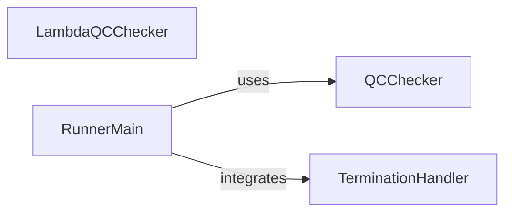

## Component Details

This subsystem is responsible for ensuring the quality of job execution and managing instance termination. It encompasses two primary quality control mechanisms: one operating within the AWS Lambda environment for pre-execution or post-processing checks, and another integrated into the main job runner for in-execution validation. Additionally, it includes a robust termination handler specifically designed to detect and respond to AWS EC2 spot instance termination notices, allowing for graceful shutdown and data preservation.

### QCChecker
Performs quality control checks on the executed job within the runner environment. It runs all defined QC checks by evaluating expressions against QC result files and can abort the Step Functions workflow execution if failures are detected.

**Related Classes/Methods**:

- <a href="https://github.com/Bayer-Group/BayerCLAW/blob/master/bclaw_runner/src/runner/qc_check.py#L11-L14" target="_blank" rel="noopener noreferrer">`BayerCLAW.bclaw_runner.src.runner.qc_check:QCFailure` (11:14)</a>
- <a href="https://github.com/Bayer-Group/BayerCLAW/blob/master/bclaw_runner/src/runner/qc_check.py#L17-L34" target="_blank" rel="noopener noreferrer">`BayerCLAW.bclaw_runner.src.runner.qc_check:abort_execution` (17:34)</a>
- <a href="https://github.com/Bayer-Group/BayerCLAW/blob/master/bclaw_runner/src/runner/qc_check.py#L36-L41" target="_blank" rel="noopener noreferrer">`BayerCLAW.bclaw_runner.src.runner.qc_check:run_one_qc_check` (36:41)</a>
- <a href="https://github.com/Bayer-Group/BayerCLAW/blob/master/bclaw_runner/src/runner/qc_check.py#L44-L55" target="_blank" rel="noopener noreferrer">`BayerCLAW.bclaw_runner.src.runner.qc_check:run_all_qc_checks` (44:55)</a>
- <a href="https://github.com/Bayer-Group/BayerCLAW/blob/master/bclaw_runner/src/runner/qc_check.py#L58-L66" target="_blank" rel="noopener noreferrer">`BayerCLAW.bclaw_runner.src.runner.qc_check:do_checks` (58:66)</a>

### TerminationHandler
Manages graceful termination for instances, particularly for spot instances. It periodically checks the EC2 metadata service for termination notices and logs warnings to facilitate graceful shutdown.

**Related Classes/Methods**:

- <a href="https://github.com/Bayer-Group/BayerCLAW/blob/master/bclaw_runner/src/runner/termination.py#L52-L71" target="_blank" rel="noopener noreferrer">`BayerCLAW.bclaw_runner.src.runner.termination:spot_termination_checker` (52:71)</a>
- <a href="https://github.com/Bayer-Group/BayerCLAW/blob/master/bclaw_runner/src/runner/termination.py#L12-L21" target="_blank" rel="noopener noreferrer">`BayerCLAW.bclaw_runner.src.runner.termination:_this_is_a_spot_instance` (12:21)</a>
- <a href="https://github.com/Bayer-Group/BayerCLAW/blob/master/bclaw_runner/src/runner/termination.py#L24-L32" target="_blank" rel="noopener noreferrer">`BayerCLAW.bclaw_runner.src.runner.termination:_do_termination_check` (24:32)</a>
- <a href="https://github.com/Bayer-Group/BayerCLAW/blob/master/bclaw_runner/src/runner/termination.py#L35-L48" target="_blank" rel="noopener noreferrer">`BayerCLAW.bclaw_runner.src.runner.termination:_termination_checker_impl` (35:48)</a>

### LambdaQCChecker
A dedicated quality control component for the AWS Lambda environment. It reads QC results from an S3 path, evaluates a specified expression, and if the check fails, it stops the associated Step Functions execution and raises a QCFailed exception.

**Related Classes/Methods**:

- <a href="https://github.com/Bayer-Group/BayerCLAW/blob/master/lambda/src/qc_checker/qc_checker.py#L19-L45" target="_blank" rel="noopener noreferrer">`BayerCLAW.lambda.src.qc_checker.qc_checker:lambda_handler` (19:45)</a>
- <a href="https://github.com/Bayer-Group/BayerCLAW/blob/master/lambda/src/qc_checker/qc_checker.py#L14-L16" target="_blank" rel="noopener noreferrer">`BayerCLAW.lambda.src.qc_checker.qc_checker:QCFailed` (14:16)</a>

### [FAQ](https://github.com/CodeBoarding/GeneratedOnBoardings/tree/main?tab=readme-ov-file#faq)