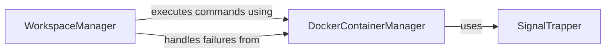

## Component Details

The Runner Execution Environment subsystem manages the local execution environment for the runner, facilitating the execution of user-defined commands within a dedicated workspace and orchestrating child containers using Docker-in-Docker. It integrates components for workspace management, Docker container operations, and signal handling to ensure robust and controlled command execution.

### WorkspaceManager
The WorkspaceManager component is responsible for creating and managing a temporary workspace for the execution of commands. It provides functionalities for writing job data to a file and executing user-defined commands within a Docker container, handling potential failures during command execution.

**Related Classes/Methods**:

- <a href="https://github.com/Bayer-Group/BayerCLAW/blob/master/bclaw_runner/src/runner/workspace.py#L21-L35" target="_blank" rel="noopener noreferrer">`bclaw_runner.src.runner.workspace:workspace` (21:35)</a>
- <a href="https://github.com/Bayer-Group/BayerCLAW/blob/master/bclaw_runner/src/runner/workspace.py#L38-L41" target="_blank" rel="noopener noreferrer">`bclaw_runner.src.runner.workspace:write_job_data_file` (38:41)</a>
- <a href="https://github.com/Bayer-Group/BayerCLAW/blob/master/bclaw_runner/src/runner/workspace.py#L44-L69" target="_blank" rel="noopener noreferrer">`bclaw_runner.src.runner.workspace:run_commands` (44:69)</a>
- <a href="https://github.com/Bayer-Group/BayerCLAW/blob/master/bclaw_runner/src/runner/workspace.py#L14-L17" target="_blank" rel="noopener noreferrer">`bclaw_runner.src.runner.workspace.UserCommandsFailed` (14:17)</a>

### DockerContainerManager
The DockerContainerManager component handles interactions with Docker to run child containers. It is responsible for pulling Docker images, retrieving container metadata, managing mounts and environment variables, and handling GPU requests for container execution.

**Related Classes/Methods**:

- <a href="https://github.com/Bayer-Group/BayerCLAW/blob/master/bclaw_runner/src/runner/dind.py#L133-L181" target="_blank" rel="noopener noreferrer">`bclaw_runner.src.runner.dind:run_child_container` (133:181)</a>
- <a href="https://github.com/Bayer-Group/BayerCLAW/blob/master/bclaw_runner/src/runner/dind.py#L108-L130" target="_blank" rel="noopener noreferrer">`bclaw_runner.src.runner.dind:pull_image` (108:130)</a>
- <a href="https://github.com/Bayer-Group/BayerCLAW/blob/master/bclaw_runner/src/runner/dind.py#L98-L105" target="_blank" rel="noopener noreferrer">`bclaw_runner.src.runner.dind:get_auth` (98:105)</a>
- <a href="https://github.com/Bayer-Group/BayerCLAW/blob/master/bclaw_runner/src/runner/dind.py#L42-L46" target="_blank" rel="noopener noreferrer">`bclaw_runner.src.runner.dind:get_container_metadata` (42:46)</a>
- <a href="https://github.com/Bayer-Group/BayerCLAW/blob/master/bclaw_runner/src/runner/dind.py#L49-L89" target="_blank" rel="noopener noreferrer">`bclaw_runner.src.runner.dind:get_mounts` (49:89)</a>
- <a href="https://github.com/Bayer-Group/BayerCLAW/blob/master/bclaw_runner/src/runner/dind.py#L92-L95" target="_blank" rel="noopener noreferrer">`bclaw_runner.src.runner.dind:get_environment_vars` (92:95)</a>
- <a href="https://github.com/Bayer-Group/BayerCLAW/blob/master/bclaw_runner/src/runner/dind.py#L29-L39" target="_blank" rel="noopener noreferrer">`bclaw_runner.src.runner.dind:get_gpu_requests` (29:39)</a>

### SignalTrapper
The SignalTrapper component is responsible for trapping and handling signals, specifically for stopping child containers gracefully upon receiving termination signals.

**Related Classes/Methods**:

- <a href="https://github.com/Bayer-Group/BayerCLAW/blob/master/bclaw_runner/src/runner/signal_trapper.py#L26-L42" target="_blank" rel="noopener noreferrer">`bclaw_runner.src.runner.signal_trapper.signal_trapper` (26:42)</a>

### [FAQ](https://github.com/CodeBoarding/GeneratedOnBoardings/tree/main?tab=readme-ov-file#faq)