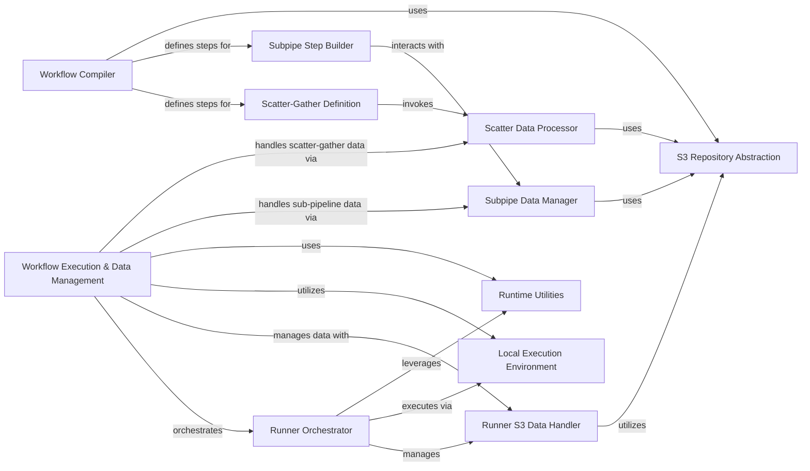

## Component Details

This system orchestrates the entire job execution lifecycle within the `bclaw_runner`, managing data handling, sub-pipeline execution, and scatter-gather operations. It compiles workflows into AWS Step Functions, processes data for parallel execution, and provides abstractions for S3 interactions, ensuring robust and scalable workflow management.

### Workflow Execution & Data Management
The overarching component responsible for orchestrating the entire job execution lifecycle within `bclaw_runner`, including comprehensive data handling (S3 interactions, caching), and facilitating data exchange for sub-pipelines and scatter-gather operations. It acts as the central control for the runtime environment.

**Related Classes/Methods**:

- `BayerCLAW.bclaw_runner.src.runner.runner_main` (full file reference)
- <a href="https://github.com/Bayer-Group/BayerCLAW/blob/master/bclaw_runner/src/runner/preamble.py#L7-L14" target="_blank" rel="noopener noreferrer">`BayerCLAW.bclaw_runner.src.runner.preamble.log_preamble` (7:14)</a>
- <a href="https://github.com/Bayer-Group/BayerCLAW/blob/master/bclaw_runner/src/runner/tagging.py#L12-L27" target="_blank" rel="noopener noreferrer">`BayerCLAW.bclaw_runner.src.runner.tagging.tag_this_instance` (12:27)</a>
- `BayerCLAW.bclaw_runner.src.runner.repo` (full file reference)
- `BayerCLAW.bclaw_runner.src.runner.cache` (full file reference)
- `BayerCLAW.lambda.src.subpipes.subpipes` (full file reference)
- `BayerCLAW.lambda.src.scatter.scatter` (full file reference)

### Subpipe Data Manager
This component is responsible for managing file transfers and job data for sub-pipelines. It handles the submission of data to a subpipe and the retrieval of results from it, primarily interacting with S3 for data storage.

**Related Classes/Methods**:

- <a href="https://github.com/Bayer-Group/BayerCLAW/blob/master/lambda/src/subpipes/subpipes.py#L58-L162" target="_blank" rel="noopener noreferrer">`BayerCLAW.lambda.src.subpipes.subpipes:lambda_handler` (58:162)</a>
- <a href="https://github.com/Bayer-Group/BayerCLAW/blob/master/lambda/src/subpipes/subpipes.py#L18-L25" target="_blank" rel="noopener noreferrer">`BayerCLAW.lambda.src.subpipes.subpipes.get_s3_object` (18:25)</a>
- <a href="https://github.com/Bayer-Group/BayerCLAW/blob/master/lambda/src/subpipes/subpipes.py#L29-L33" target="_blank" rel="noopener noreferrer">`BayerCLAW.lambda.src.subpipes.subpipes.put_s3_object` (29:33)</a>
- <a href="https://github.com/Bayer-Group/BayerCLAW/blob/master/lambda/src/subpipes/subpipes.py#L36-L55" target="_blank" rel="noopener noreferrer">`BayerCLAW.lambda.src.subpipes.subpipes.copy_file_impl` (36:55)</a>

### Workflow Compiler
This component is responsible for compiling and defining AWS Step Functions state machines. It orchestrates various step types, including scatter-gather, batch, subpipe, native, chooser, and parallel steps, into a coherent workflow definition.

**Related Classes/Methods**:

- <a href="https://github.com/Bayer-Group/BayerCLAW/blob/master/lambda/src/compiler/pkg/state_machine_resources.py#L69-L108" target="_blank" rel="noopener noreferrer">`BayerCLAW.lambda.src.compiler.pkg.state_machine_resources:process_step` (69:108)</a>
- <a href="https://github.com/Bayer-Group/BayerCLAW/blob/master/lambda/src/compiler/pkg/state_machine_resources.py#L111-L133" target="_blank" rel="noopener noreferrer">`BayerCLAW.lambda.src.compiler.pkg.state_machine_resources:make_branch` (111:133)</a>
- <a href="https://github.com/Bayer-Group/BayerCLAW/blob/master/lambda/src/compiler/pkg/state_machine_resources.py#L175-L210" target="_blank" rel="noopener noreferrer">`BayerCLAW.lambda.src.compiler.pkg.state_machine_resources:handle_state_machine` (175:210)</a>
- <a href="https://github.com/Bayer-Group/BayerCLAW/blob/master/lambda/src/compiler/pkg/state_machine_resources.py#L24-L44" target="_blank" rel="noopener noreferrer">`BayerCLAW.lambda.src.compiler.pkg.state_machine_resources:make_initializer_step` (24:44)</a>
- <a href="https://github.com/Bayer-Group/BayerCLAW/blob/master/lambda/src/compiler/pkg/state_machine_resources.py#L148-L172" target="_blank" rel="noopener noreferrer">`BayerCLAW.lambda.src.compiler.pkg.state_machine_resources:write_state_machine_to_s3` (148:172)</a>

### Scatter-Gather Definition
This component defines the structure and steps for scatter-gather operations within the state machine. It includes the initial scatter step, the map step for parallel processing, and the final gather step to collect results.

**Related Classes/Methods**:

- <a href="https://github.com/Bayer-Group/BayerCLAW/blob/master/lambda/src/compiler/pkg/scatter_gather_resources.py#L122-L145" target="_blank" rel="noopener noreferrer">`BayerCLAW.lambda.src.compiler.pkg.scatter_gather_resources:handle_scatter_gather` (122:145)</a>
- <a href="https://github.com/Bayer-Group/BayerCLAW/blob/master/lambda/src/compiler/pkg/scatter_gather_resources.py#L11-L28" target="_blank" rel="noopener noreferrer">`BayerCLAW.lambda.src.compiler.pkg.scatter_gather_resources:scatter_step` (11:28)</a>
- <a href="https://github.com/Bayer-Group/BayerCLAW/blob/master/lambda/src/compiler/pkg/scatter_gather_resources.py#L42-L80" target="_blank" rel="noopener noreferrer">`BayerCLAW.lambda.src.compiler.pkg.scatter_gather_resources:map_step` (42:80)</a>
- <a href="https://github.com/Bayer-Group/BayerCLAW/blob/master/lambda/src/compiler/pkg/scatter_gather_resources.py#L103-L119" target="_blank" rel="noopener noreferrer">`BayerCLAW.lambda.src.compiler.pkg.scatter_gather_resources:gather_step` (103:119)</a>
- <a href="https://github.com/Bayer-Group/BayerCLAW/blob/master/lambda/src/compiler/pkg/scatter_gather_resources.py#L83-L100" target="_blank" rel="noopener noreferrer">`BayerCLAW.lambda.src.compiler.pkg.scatter_gather_resources:scatter_init_step` (83:100)</a>

### Subpipe Step Builder
This component specifically builds the individual steps involved in executing a subpipe within a larger state machine. It includes steps for submitting files, running the subpipe state machine, and retrieving output files.

**Related Classes/Methods**:

- <a href="https://github.com/Bayer-Group/BayerCLAW/blob/master/lambda/src/compiler/pkg/subpipe_resources.py#L82-L96" target="_blank" rel="noopener noreferrer">`BayerCLAW.lambda.src.compiler.pkg.subpipe_resources:handle_subpipe` (82:96)</a>
- <a href="https://github.com/Bayer-Group/BayerCLAW/blob/master/lambda/src/compiler/pkg/subpipe_resources.py#L9-L26" target="_blank" rel="noopener noreferrer">`BayerCLAW.lambda.src.compiler.pkg.subpipe_resources:file_submit_step` (9:26)</a>
- <a href="https://github.com/Bayer-Group/BayerCLAW/blob/master/lambda/src/compiler/pkg/subpipe_resources.py#L29-L57" target="_blank" rel="noopener noreferrer">`BayerCLAW.lambda.src.compiler.pkg.subpipe_resources:run_subpipe_step` (29:57)</a>
- <a href="https://github.com/Bayer-Group/BayerCLAW/blob/master/lambda/src/compiler/pkg/subpipe_resources.py#L60-L79" target="_blank" rel="noopener noreferrer">`BayerCLAW.lambda.src.compiler.pkg.subpipe_resources:file_retrieve_step` (60:79)</a>

### Scatter Data Processor
This component is responsible for processing and expanding scatter data for parallel execution. It handles various data sources and formats, including static lists, job data references, file contents, and S3 globs, to prepare data for map steps.

**Related Classes/Methods**:

- <a href="https://github.com/Bayer-Group/BayerCLAW/blob/master/lambda/src/scatter/scatter.py#L133-L190" target="_blank" rel="noopener noreferrer">`BayerCLAW.lambda.src.scatter.scatter:lambda_handler` (133:190)</a>
- <a href="https://github.com/Bayer-Group/BayerCLAW/blob/master/lambda/src/scatter/scatter.py#L48-L50" target="_blank" rel="noopener noreferrer">`BayerCLAW.lambda.src.scatter.scatter.expand_scatter_data` (48:50)</a>
- <a href="https://github.com/Bayer-Group/BayerCLAW/blob/master/lambda/src/scatter/scatter.py#L53-L105" target="_blank" rel="noopener noreferrer">`BayerCLAW.lambda.src.scatter.scatter._expand_scatter_data_impl` (53:105)</a>
- <a href="https://github.com/Bayer-Group/BayerCLAW/blob/master/lambda/src/scatter/scatter.py#L31-L45" target="_blank" rel="noopener noreferrer">`BayerCLAW.lambda.src.scatter.scatter.expand_glob` (31:45)</a>
- <a href="https://github.com/Bayer-Group/BayerCLAW/blob/master/lambda/src/scatter/scatter.py#L108-L113" target="_blank" rel="noopener noreferrer">`BayerCLAW.lambda.src.scatter.scatter.scatterator` (108:113)</a>
- <a href="https://github.com/Bayer-Group/BayerCLAW/blob/master/lambda/src/scatter/scatter.py#L22-L28" target="_blank" rel="noopener noreferrer">`BayerCLAW.lambda.src.scatter.scatter.get_job_data` (22:28)</a>
- <a href="https://github.com/Bayer-Group/BayerCLAW/blob/master/lambda/src/scatter/scatter.py#L116-L130" target="_blank" rel="noopener noreferrer">`BayerCLAW.lambda.src.scatter.scatter.write_job_data_template` (116:130)</a>

### S3 Repository Abstraction
This foundational component provides a high-level abstraction for interacting with S3 buckets and prefixes as repositories. It simplifies file and path management, enabling consistent access and manipulation of data within the system.

**Related Classes/Methods**:

- <a href="https://github.com/Bayer-Group/BayerCLAW/blob/master/lambda/src/common/python/repo_utils.py#L59-L93" target="_blank" rel="noopener noreferrer">`BayerCLAW.lambda.src.common.python.repo_utils.Repo` (59:93)</a>
- <a href="https://github.com/Bayer-Group/BayerCLAW/blob/master/lambda/src/common/python/repo_utils.py#L18-L24" target="_blank" rel="noopener noreferrer">`BayerCLAW.lambda.src.common.python.repo_utils.S3File` (18:24)</a>
- <a href="https://github.com/Bayer-Group/BayerCLAW/blob/master/lambda/src/common/python/repo_utils.py#L65-L67" target="_blank" rel="noopener noreferrer">`BayerCLAW.lambda.src.common.python.repo_utils.Repo.from_uri` (65:67)</a>
- <a href="https://github.com/Bayer-Group/BayerCLAW/blob/master/lambda/src/common/python/repo_utils.py#L81-L86" target="_blank" rel="noopener noreferrer">`BayerCLAW.lambda.src.common.python.repo_utils.Repo.qualify` (81:86)</a>
- <a href="https://github.com/Bayer-Group/BayerCLAW/blob/master/lambda/src/common/python/repo_utils.py#L88-L90" target="_blank" rel="noopener noreferrer">`BayerCLAW.lambda.src.common.python.repo_utils.Repo.sub_repo` (88:90)</a>

### Runner Orchestrator
This is the primary control flow component for the 'bclaw_runner' application. It manages the overall execution, including input/output handling, command execution, and error handling, orchestrating the various stages of a job run.

**Related Classes/Methods**:

- <a href="https://github.com/Bayer-Group/BayerCLAW/blob/master/bclaw_runner/src/runner/runner_main.py#L43-L116" target="_blank" rel="noopener noreferrer">`BayerCLAW.bclaw_runner.src.runner.runner_main:main` (43:116)</a>
- <a href="https://github.com/Bayer-Group/BayerCLAW/blob/master/bclaw_runner/src/runner/runner_main.py#L119-L146" target="_blank" rel="noopener noreferrer">`BayerCLAW.bclaw_runner.src.runner.runner_main:cli` (119:146)</a>

### Runner S3 Data Handler
This component specifically handles all S3-related data operations for the 'bclaw_runner'. It manages reading and writing job data, checking for previous runs, downloading inputs, and uploading outputs, ensuring data persistence and run state management.

**Related Classes/Methods**:

- <a href="https://github.com/Bayer-Group/BayerCLAW/blob/master/bclaw_runner/src/runner/repo.py#L50-L241" target="_blank" rel="noopener noreferrer">`BayerCLAW.bclaw_runner.src.runner.repo.Repository` (50:241)</a>
- <a href="https://github.com/Bayer-Group/BayerCLAW/blob/master/bclaw_runner/src/runner/repo.py#L65-L71" target="_blank" rel="noopener noreferrer">`BayerCLAW.bclaw_runner.src.runner.repo.Repository.read_job_data` (65:71)</a>
- <a href="https://github.com/Bayer-Group/BayerCLAW/blob/master/bclaw_runner/src/runner/repo.py#L89-L111" target="_blank" rel="noopener noreferrer">`BayerCLAW.bclaw_runner.src.runner.repo.Repository.check_files_exist` (89:111)</a>
- <a href="https://github.com/Bayer-Group/BayerCLAW/blob/master/bclaw_runner/src/runner/repo.py#L151-L158" target="_blank" rel="noopener noreferrer">`BayerCLAW.bclaw_runner.src.runner.repo.Repository.download_inputs` (151:158)</a>
- <a href="https://github.com/Bayer-Group/BayerCLAW/blob/master/bclaw_runner/src/runner/repo.py#L203-L208" target="_blank" rel="noopener noreferrer">`BayerCLAW.bclaw_runner.src.runner.repo.Repository.upload_outputs` (203:208)</a>
- <a href="https://github.com/Bayer-Group/BayerCLAW/blob/master/bclaw_runner/src/runner/repo.py#L210-L223" target="_blank" rel="noopener noreferrer">`BayerCLAW.bclaw_runner.src.runner.repo.Repository.check_for_previous_run` (210:223)</a>
- <a href="https://github.com/Bayer-Group/BayerCLAW/blob/master/bclaw_runner/src/runner/repo.py#L233-L241" target="_blank" rel="noopener noreferrer">`BayerCLAW.bclaw_runner.src.runner.repo.Repository.put_run_status` (233:241)</a>

### Local Execution Environment
This component provides and manages the temporary local file system workspace for the 'bclaw_runner'. It also handles the execution of shell commands within a containerized environment and manages the writing of job data files to the workspace.

**Related Classes/Methods**:

- <a href="https://github.com/Bayer-Group/BayerCLAW/blob/master/bclaw_runner/src/runner/workspace.py#L21-L35" target="_blank" rel="noopener noreferrer">`BayerCLAW.bclaw_runner.src.runner.workspace.workspace` (21:35)</a>
- <a href="https://github.com/Bayer-Group/BayerCLAW/blob/master/bclaw_runner/src/runner/workspace.py#L38-L41" target="_blank" rel="noopener noreferrer">`BayerCLAW.bclaw_runner.src.runner.workspace.write_job_data_file` (38:41)</a>
- <a href="https://github.com/Bayer-Group/BayerCLAW/blob/master/bclaw_runner/src/runner/workspace.py#L44-L69" target="_blank" rel="noopener noreferrer">`BayerCLAW.bclaw_runner.src.runner.workspace.run_commands` (44:69)</a>
- <a href="https://github.com/Bayer-Group/BayerCLAW/blob/master/bclaw_runner/src/runner/workspace.py#L14-L17" target="_blank" rel="noopener noreferrer">`BayerCLAW.bclaw_runner.src.runner.workspace.UserCommandsFailed` (14:17)</a>

### Runtime Utilities
This component is a collection of supporting utilities used during runtime. It includes functionalities for caching reference inputs, performing string substitutions for dynamic values, and conducting quality control checks on execution results.

**Related Classes/Methods**:

- <a href="https://github.com/Bayer-Group/BayerCLAW/blob/master/bclaw_runner/src/runner/cache.py#L68-L82" target="_blank" rel="noopener noreferrer">`BayerCLAW.bclaw_runner.src.runner.cache.get_reference_inputs` (68:82)</a>
- <a href="https://github.com/Bayer-Group/BayerCLAW/blob/master/bclaw_runner/src/runner/string_subs.py#L16-L27" target="_blank" rel="noopener noreferrer">`BayerCLAW.bclaw_runner.src.runner.string_subs.substitute` (16:27)</a>
- <a href="https://github.com/Bayer-Group/BayerCLAW/blob/master/bclaw_runner/src/runner/string_subs.py#L30-L39" target="_blank" rel="noopener noreferrer">`BayerCLAW.bclaw_runner.src.runner.string_subs.substitute_image_tag` (30:39)</a>
- <a href="https://github.com/Bayer-Group/BayerCLAW/blob/master/bclaw_runner/src/runner/qc_check.py#L58-L66" target="_blank" rel="noopener noreferrer">`BayerCLAW.bclaw_runner.src.runner.qc_check.do_checks` (58:66)</a>
- <a href="https://github.com/Bayer-Group/BayerCLAW/blob/master/bclaw_runner/src/runner/qc_check.py#L17-L34" target="_blank" rel="noopener noreferrer">`BayerCLAW.bclaw_runner.src.runner.qc_check.abort_execution` (17:34)</a>

### [FAQ](https://github.com/CodeBoarding/GeneratedOnBoardings/tree/main?tab=readme-ov-file#faq)