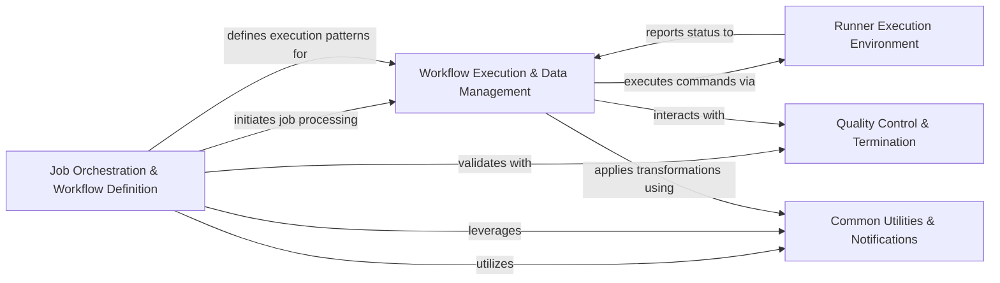

## Component Details

This graph illustrates the architecture of BayerCLAW, a system designed for orchestrating and executing complex bioinformatics workflows. The main flow involves the `Job Orchestration & Workflow Definition` component, which handles initial job setup, routing, and compiles high-level workflow definitions into executable state machine language. This compiled workflow is then passed to the `Workflow Execution & Data Management` component, which manages the actual execution, data handling, and specific workflow patterns like scatter-gather. The `Runner Execution Environment` provides the isolated environment for command execution. Throughout the process, `Quality Control & Termination` ensures correctness and manages instance lifecycle, while `Common Utilities & Notifications` provides shared services for data manipulation and communication.

### Job Orchestration & Workflow Definition
Manages the initial setup, routing, and comprehensive compilation of high-level workflow definitions into executable AWS Step Functions state machine language, including handling various step types (batch, scatter-gather, parallel, sub-pipeline, native, chooser) and their validation.

**Related Classes/Methods**:

- `BayerCLAW.lambda.src.initializer.initializer` (full file reference)
- `BayerCLAW.lambda.src.router.job_router` (full file reference)
- `BayerCLAW.lambda.src.job_def.register` (full file reference)
- `BayerCLAW.lambda.src.compiler.pkg.compiler` (full file reference)
- `BayerCLAW.lambda.src.compiler.pkg.state_machine_resources` (full file reference)
- `BayerCLAW.lambda.src.compiler.pkg.util` (full file reference)
- `BayerCLAW.lambda.src.compiler.pkg.validation` (full file reference)
- `BayerCLAW.lambda.src.compiler.pkg.scatter_gather_resources` (full file reference)
- `BayerCLAW.lambda.src.compiler.pkg.chooser_resources` (full file reference)
- `BayerCLAW.lambda.src.compiler.pkg.enhanced_parallel_resources` (full file reference)
- `BayerCLAW.lambda.src.compiler.pkg.subpipe_resources` (full file reference)
- `BayerCLAW.lambda.src.compiler.pkg.native_step_resources` (full file reference)
- `BayerCLAW.lambda.src.compiler.pkg.batch_resources` (full file reference)
- `BayerCLAW.lambda.src.chooser.multichooser` (full file reference)

### Workflow Execution & Data Management
The central control component for the `bclaw_runner`, managing the entire job execution lifecycle, including data handling (S3 repository interactions, caching), and facilitating data exchange for sub-pipelines and scatter-gather operations during execution.

**Related Classes/Methods**:

- `BayerCLAW.bclaw_runner.src.runner.runner_main` (full file reference)
- <a href="https://github.com/Bayer-Group/BayerCLAW/blob/master/bclaw_runner/src/runner/preamble.py#L7-L14" target="_blank" rel="noopener noreferrer">`BayerCLAW.bclaw_runner.src.runner.preamble.log_preamble` (7:14)</a>
- <a href="https://github.com/Bayer-Group/BayerCLAW/blob/master/bclaw_runner/src/runner/tagging.py#L12-L27" target="_blank" rel="noopener noreferrer">`BayerCLAW.bclaw_runner.src.runner.tagging.tag_this_instance` (12:27)</a>
- `BayerCLAW.bclaw_runner.src.runner.repo` (full file reference)
- `BayerCLAW.bclaw_runner.src.runner.cache` (full file reference)
- `BayerCLAW.lambda.src.subpipes.subpipes` (full file reference)
- `BayerCLAW.lambda.src.scatter.scatter` (full file reference)

### Runner Execution Environment
Manages the local execution environment for the runner, responsible for running user-defined commands within that workspace and handling the execution of child containers using Docker-in-Docker.

**Related Classes/Methods**:

- <a href="https://github.com/Bayer-Group/BayerCLAW/blob/master/bclaw_runner/src/runner/workspace.py#L21-L35" target="_blank" rel="noopener noreferrer">`BayerCLAW.bclaw_runner.src.runner.workspace` (21:35)</a>
- `BayerCLAW.bclaw_runner.src.runner.dind` (full file reference)
- <a href="https://github.com/Bayer-Group/BayerCLAW/blob/master/bclaw_runner/src/runner/signal_trapper.py#L26-L42" target="_blank" rel="noopener noreferrer">`BayerCLAW.bclaw_runner.src.runner.signal_trapper.signal_trapper` (26:42)</a>

### Quality Control & Termination
Performs quality control checks both within the AWS Lambda environment and during job execution, and manages the graceful termination of instances, particularly for spot instances.

**Related Classes/Methods**:

- `BayerCLAW.lambda.src.qc_checker.qc_checker` (full file reference)
- `BayerCLAW.bclaw_runner.src.runner.qc_check` (full file reference)
- `BayerCLAW.bclaw_runner.src.runner.termination` (full file reference)

### Common Utilities & Notifications
Provides shared utility functions for data manipulation, including general substitutions, repository operations, reading various file formats, and generating/sending notifications related to workflow state changes.

**Related Classes/Methods**:

- `BayerCLAW.lambda.src.common.python.substitutions` (full file reference)
- `BayerCLAW.lambda.src.common.python.repo_utils` (full file reference)
- `BayerCLAW.lambda.src.common.python.file_select` (full file reference)
- `BayerCLAW.lambda.src.notifications.notifications` (full file reference)
- `BayerCLAW.bclaw_runner.src.runner.string_subs` (full file reference)

### [FAQ](https://github.com/CodeBoarding/GeneratedOnBoardings/tree/main?tab=readme-ov-file#faq)