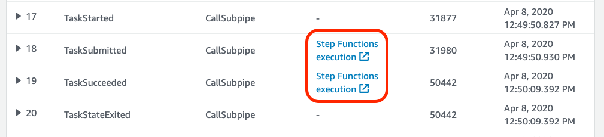
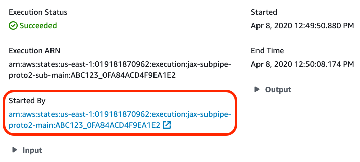

# Using Subpipes in BayerCLAW

## Overview
An BayerCLAW workflow can execute other BayerCLAW workflows as subpipes. Use cases for this include:
- Creating reusable, modular workflows
- Breaking large, complex workflows into manageable units
- Enabling workflows to be developed and tested as separate, logical units 

#### How it works
In the main pipeline, users specify a list of files form the workflow's repository to be sent to the subpipe.
A repository is created for the subpipe -- this will be in a folder inside of the main repository -- and the specifiec files copied into the sub-repository. The subpipe
is invoked, receiving the same job data record that the main pipeline received. After the subpipe finishes,
the main pipeline copies files out of the subpipe's repository into its own repository, and continues
execution.

There are no special requirements for the subpipe. It can be an ordinary BayerCLAW workflow (however, see
[Running a subpipe independently](#running-a-subpipe-independently) for additional information). The subpipe
execution is somewhat different from a normal BayerCLAW run:
- The repository established by the main workflow overrides the repository designated in the subpipe's workflow
definition
- The launcher bucket is bypassed, and subpipe's Step Functions state machine is invoked directly.

## Calling a subpipe
To invoke a subpipe, the parent pipeline must contain a *subpipe step*.

#### Subpipe step syntax
```yaml
  SubpipeStepName:
    submit:
      - filename1.txt -> filename99.txt
      - filename2.txt
    subpipe: my-subpipe-workflow
    retrieve:
      - filenameX.txt -> filenameY.txt
      - filenameZ.txt
```
The fields of the subpipe step are:
- `submit`: A list of files to be copied from the parent workflow's repository to the subpipe's repository.
Use the syntax `parent_wf_filename -> subpipe_filename` to rename the file upon copying. If the file does not 
need to be renamed, you can just provide the filename (e.g. `filename2`) above. The `submit` field may be omitted
if the subpipe does not need any files from the main workflow.

- `subpipe`: The name of the BayerCLAW workflow to be run as a subpipe. For testing purposes, you may also provide the
Amazon Resource Name (ARN) of a Step Functions state machine that simulates the behavior of the real subpipe.
 
- `retrieve`: A list of files to be copied from the subpipe's repository to the parent workflow's repository.
As with `submit`, use the syntax `subpipe_filename -> parent_wf_filename` to rename the file, or just the name
of the file if it does not need to be renamed. The `retrieve` field may be omitted if there are no files to
copy into the parent workflow's repository.

#### String substitution and file globs
Values from the execution's job data file can be substituted into any filename in the `submit` or `retrieve`
field. For instance, this would be valid (though not really recommented): `${job.project_id}.txt -> ${job.sample_id}.txt`.

Filename globbing is not available in subpipe steps.

#### Subpipes and scatter/gather
A subpipe may be invoked from inside of a scatter step. For instance, this is a small workflow that scatters
over a set of sequence files, each branch passing a sequence file and a configuration file to a subpipe and
collecting the .bam files produced: 

```yaml
  DoScatter:
    scatter:
      contigs: contigs*.fa
    inputs:
      config: config.cfg
    steps:
      -
        RunSubpipe:
          submit:
            - ${scatter.contigs} -> seqfile.fa
            - ${parent.config}
          subpipe: sub-workflow
          retrieve:
            - output.bam
    outputs:
      bamfile: output.bam
```

Note that, while the `scatter` and `parent` variables from the scatter step are available to the subpipe
step itself, *the workflow invoked by the subpipe will not have access to these values*.

The sub-workflow, itself being an BayerCLAW workflow, may also contain its own scatter steps.

## Details
#### Job tracking in the AWS console
Although a subpipe call involves invoking a completely different workflow, AWS Step Functions makes it easy to track
both executions through the AWS console.

In the console, the parent pipeline execution will contain links to the subpipe execution under the 
`Execution event history` list:


And the subpipe execution console page will be linked back to the parent in the `Execution details` box:


Due to Step Functions execution naming restrictions, the subpipe execution will have a different name from the
parent execution.

#### Running a subpipe independently
In some cases, it might be desirable to be able to run a subpipe in a standalone manner. This could, for
example, be used to test the subpipe in isolation without running the entire pipeline. To accomplish
this, it is recommended that the subpipe start with one or more initialization steps that emulate the
input from the parent pipeline, and then use the `skip_if_output_exists` option to skip these steps when
the subpipe is being invoked from a parent pipeline.

For example, here is a simple workflow that initializes its repository and then does something useful:
```yaml
steps:
  Initialize:
    image: ubuntu
    inputs:
      input_reads1: ${job.READS1}
      input_reads2: ${job.READS2}
    commands:
      - mv ${input_reads1} ${output_reads1}
      - mv ${input_reads2} ${output_reads2}
    outputs:
      output_reads1: reads1.fq.gz
      output_reads2: reads2.fq.gz
    skip_if_output_exists: true

  DoSomething:
    image: worker
    inputs:
      reads1: reads1.fq.gz
      reads2: reads2.fq.gz
    commands:
      - do_something ${reads1} ${reads2} > ${output_file}
    outputs:
      output_file: output.bam
```

Then the parent pipeline may call this subpipe like this:
```yaml
  # initial processing steps here...

  RunSubpipe:
    submit:
      - processed_reads1.fq.gz -> reads1.fq.gz
      - processed_reads2.fq.gz -> reads2.fq.gz
    subpipe: sample-subpipe
    retrieve:
      - output.bam
```

When the parent pipeline calls the subpipe, the subpipe will skip the `Initialize`
step because the output files have already been written to its repository by the parent.
Execution will then proceed with the `DoSomething` step. 
