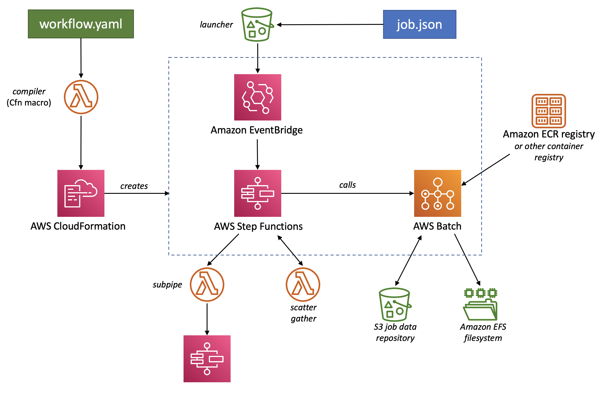
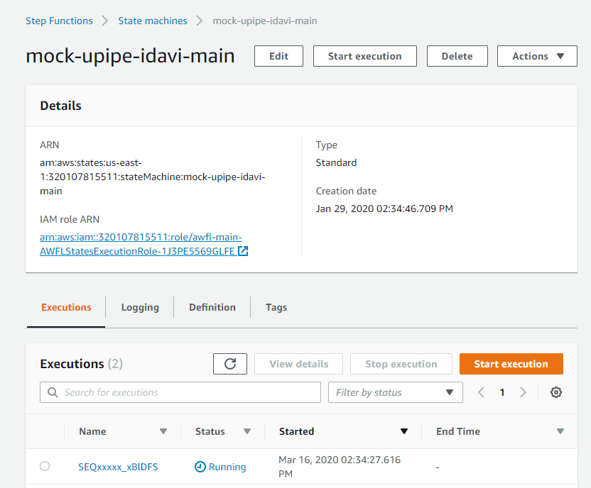
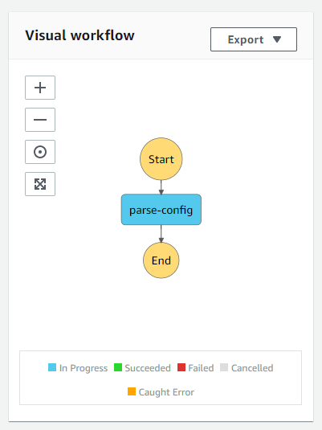
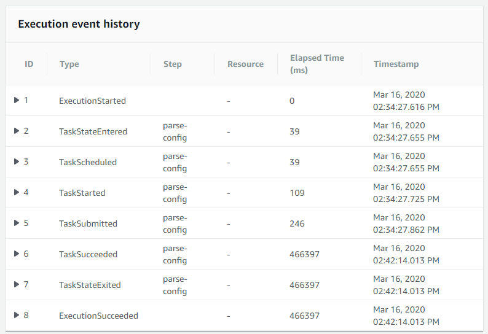

# What is BayerCLAW?

BayerCLAW stands for **Bayer CLoud Automated Workflows**.

BayerCLAW makes it easier to run scientific computations on the AWS cloud.
It simplifies using two powerful but complex technologies, AWS Batch and AWS Step Functions.

An BayerCLAW workflow consists of a series of steps.
Each step is one or more commands to run, and a Docker image to run them in.
Commands could be Bash commands, R or Python scripts, Java programs -- whatever.
Each step can specify its memory and CPU requirements.
In multi-step workflows, the inputs and outputs of each step are automatically transferred to and from S3 for storage.
Some steps may parallelize work across many executions of the same container (scatter/gather pattern).

This tutorial will guide you through writing a multi-step BayerCLAW workflow,
introducing most of the features along the way.
Even so, it won't illustrate *all* the features and options.
Make sure to explore the rest of the documentation to find out what else is possible.

# Prerequisites

To use BayerCLAW, you need admin-level access to an AWS account. Someone -- maybe you -- should have 
already [installed BayerCLAW](deployment.md) in the account. This only needs to be done once per account.

The account should also have at least one S3 bucket you can use to store data.
BayerCLAW does not create this bucket, because workflows are temporary, but data is forever.

Finally, you need an environment in which you can run AWS CLI commands and build Docker images.
This might be a Mac laptop, or a Windows machine with WSL2 (?), or SSH access to a Linux box.

# A "hello world" template

Let's start with the simplest possible BayerCLAW workflow.
You can use this to check that BayerCLAW is installed correctly and all your tools work.

```yaml
Transform: BC_Compiler

params:
  repository: s3://bayerclaw-tutorial/runs/${job.job_id}

steps:
  - parse_config:
      image: docker.io/library/ubuntu
      commands:
        - echo 'Hello, World!'
```

The first line, `Transform: BC_Compiler`, is boilerplate that should appear as the first line of every BayerCLAW workflow.
If you're curious, it's required by AWS CloudFormation under the hood.

The `params` block lays out some information that's shared by all steps in the workflow. The required `repository` field 
tells BayerCLAW where to store the files this workflow will generate as it runs, in our "repository" S3 bucket.
This example workflow doesn't generate any files yet, but we'll add outputs in later versions.
We use the `${job.job_id}` variable here to tell BayerCLAW to look up a field named `job_id` in the input job data file
and substitute it into the repository name string. This is done so that each execution of the workflow writes files to 
its own subdirectory.

The `steps` block lays out what the workflow will actually do when it runs.
Right now, we've declared only one step, which we decided to name `parse_config`.
When it runs, it will use the public `ubuntu` image, the one you get if you type `docker run ubuntu ...` from the command line.
By default, the `image` parameter refers to images in your account's ECR repository;
this is where you will typically store your custom-built images.
But to get started quickly, we'll start with the public `ubuntu` image from Docker.
To reference those images from BayerCLAW, you have to give their full path, `docker.io/library/some-public-image-name`.

Finally, when BayerCLAW runs the `ubuntu` image, it will run a single Bash command inside, to echo the traditional greeting.
This field is a YAML list, so you can add as many additional commands here as you want.
However, best practice would be to move most of that complexity to a script inside your custom Docker image.

## Deploying "hello world"

Save this code to a file called `workflow.yaml`.
Change the bucket name `bayerclaw-demo` to the name of a bucket you've created in your account.

BayerCLAW workflows are deployed through AWS CloudFormation.
This can be done from the AWS web console, but for the sake of brevity we'll use the AWS CLI utility
in this tutorial:

```bash
aws cloudformation deploy --template-file workflow.yaml --stack-name assembler-wf --capabilities CAPABILITY_IAM
```

If all goes well, you should see:

```
Waiting for changeset to be created..
Waiting for stack create/update to complete
Successfully created/updated stack - assembler-wf
```

If not, then it's time for some debugging.

## Debugging "hello world"

If you have Python 3 and the BayerCLAW source code installed locally, you can run the BayerCLAW compiler locally to see any error messages:

```bash
~/<bayerclaw home>/lambda/src/compiler/compiler_cli.py workflow.yaml cloudformation_output.tmp stepfunctions_output.tmp
```

The curious can look at `cloudformation_output.tmp` to see just what CloudFormation will actually execute on your behalf.

If you don't have BayerCLAW installed locally, you'll need to retrieve the logs for the "BC_Compiler" lambda function.
You can find it by running

```bash
aws cloudformation describe-stack-resource --stack-name bclaw-main --logical-resource-id bclawCompilerLambdaLogGroup
```

and looking for a field named `PhysicalResourceId`.

Using the log group ID and the current date, you can get the logs.
The date is optional, but should help reduce the amount of irrelevant noise.
If you're in a busy account, your logs could be mixed in with other people's efforts to compile their workflows in the same account.

```bash
aws logs filter-log-events --log-group-name /aws/lambda/bclaw-main-bclawCompilerLambda-ABCDEFGHIJKL --log-stream-name-prefix 2021/02/10/
```

## Running "hello world"

Every BayerCLAW workflow needs some input parameters.
Even our simple example expects one parameter, `job_id`.
We record our parameters in a JSON file, which I'll save as `job.json`.
(The name of job file doesn't matter, so it can be any valid name.)

```json
{
  "job_id": "SEQxxxxx"
}
```

Based on the `params` of the workflow we authored, we know that if this job produced any output files, they would go to
our repository at `s3://bayerclaw-tutorial/runs/SEQxxxxx`.

When we deployed our BayerCLAW, it created a special S3 bucket named something like `bclaw-main-launcher-123456789012`.
where `123456789012` is the AWS account number.
Unlike the "repository" bucket, this bucket is not really for storing data.
Its only purpose is to launch an execution of our workflow, whenever a JSON job file is copied into it. But in
order to launch a workflow, the job file needs to be placed in a folder named after the workflow to be run. 
Therefore, recalling that we deployed our workflow to a CloudFormation stack named `assembler-wf`,
to run our workflow we just do this:

```bash
aws s3 cp job.json s3://bclaw-main-launcher-123456789012/assembler-wf/
```

## How the pieces fit together

If you're familiar with AWS, the diagram below shows how the pieces of BayerCLAW fit together.
In particular, note that the workflow definition (`workflow.yaml`) uses CloudFormation to create
a state machine in Step Functions and a launcher bucket in S3.
Also note that the copying a job file (`job.json`) to the launcher bucket triggers
execution of the state machine, and the jobs are run on AWS Batch.

If that means nothing to you, no worries.
You can use BayerCLAW without a detailed understanding of how it uses AWS on your behalf.
(Though it sometimes helps for debugging!)

<!-- todo: update this diagram -->


## Monitoring "hello world"

The AWS Step Functions web console is one good place to monitor your jobs.
There will be a state machine matching your workflow stack name.
The execution name will be your `job_name`, with a random suffix appended (todo: ouch).
(This way, even if you run the same job twice, each execution gets a unique name.)



Clicking on a particular execution shows both a visual summary of the steps in your workflow,
and a detailed series of events that occur as it executes.
Our workflow only has one step so far, but it still generates several different events as it runs.





If your job fails -- due to a network glitch, a coding error, out of memory, or something else --
BayerCLAW will retry 3 times before giving up.
This ensures that transient errors don't derail your work.
During development, however, you may want to manually kill jobs that fail due to coding errors, missing dependencies, and the like.

# Compute resources

Because this is just a demonstration workflow, it doesn't need much in the way of CPU or memory -- but most jobs will.
By default, all jobs get 1 whole CPU and 1 GB of RAM.
Jobs also run on machines with 1 TB of scratch disk space, but sometimes multiple jobs run on the same machine, so they have to share.
If you'd like to request more resources, you just add on to your step definition:

```yaml
steps:
  - parse_config:
      image: micro-assembler
      commands:
        - echo 'Hello, BayerCLAW world!'
      compute:
        cpus: 4
        memory: 16 Gb
```

Keep in mind that AWS machines have 2, 4, or 8 GB of RAM per CPU.
Requesting other ratios is possible, but will likely result in wasted resources.
For ultimate control, it is possible to direct jobs to a specific AWS Batch queue.

# Adding a custom Docker image

Most workflows will need a custom Docker image with specific scripts and libraries installed,
rather than using a Docker image published by someone else.
Almost any Docker image can be used with an BayerCLAW workflow,
and the usual process is used for building, tagging, and pushing images.

For the purpose of this tutorial, we'll build a very simple image that contains a couple standard command-line tools:

```Dockerfile
FROM amazonlinux:2
RUN yum install -y awscli jq
```

We can then use the command line to build, tag, and push it.
Replace `micro-assembler` with the name of your Docker image,
and `123456789012` with your AWS account number.
The ECR repository only needs to be created once (re-running the command afterwards will produce a harmless error).
Depending on your environment, you may or may not need `sudo`.

```bash
aws ecr create-repository --repository-name micro-assembler
sudo docker build -t micro-assembler -t 123456789012.dkr.ecr.us-east-1.amazonaws.com/micro-assembler .
sudo $(aws ecr get-login --no-include-email) # good for 12 hours
sudo docker push 123456789012.dkr.ecr.us-east-1.amazonaws.com/micro-assembler
```

Modify your workflow file to reference the new image.
By default, BayerCLAW assumes that images come from your AWS account's ECR,
so `micro-assembler` and `123456789012.dkr.ecr.us-east-1.amazonaws.com/micro-assembler` are equivalent here.

```yaml
steps:
  - parse_config:
      image: micro-assembler
      commands:
        - echo 'Hello, BayerCLAW world!'
```

Now you can follow the same steps to re-deploy the workflow, debug it if necessary, launch a job, and monitor it.

# Inputs and outputs

So far our example doesn't take any user input, which means it's not very interesting.
For a small number of inputs, I can embed them directly in the JSON job file.
For my pipeline, however, I'm imagining a large and complex configuration file to control the pipeline.
Here's my pipeline configuration file, listing 2 fake genomics samples to process:

```json
{
  "samples": [
    {
      "name": "S001",
      "read1": "s3://mock-sequencing-bucket/inputs/SEQxxxxx_S001_1.fasta",
      "read2": "s3://mock-sequencing-bucket/inputs/SEQxxxxx_S001_2.fasta"
    },
    {
      "name": "S002",
      "read1": "s3://mock-sequencing-bucket/inputs/SEQxxxxx_S002_1.fasta",
      "read2": "s3://mock-sequencing-bucket/inputs/SEQxxxxx_S002_2.fasta"
    }
  ]
}
```

Now I'll store my configuration file in S3, and just record the path to it in my job file:

```json
{
  "job_id": "SEQxxxxx",
  "config": "s3://mock-sequencing-bucket/inputs/mock_config.json"
}
```

I want the first step of my pipeline to download this configuration file, do some processing on it, and then upload the modified file.
In a real pipeline, I would use this opportunity to fill in default values, validate user-supplied parameters, and so on.
The fully-validated config file would then drive the rest of my pipeline steps.
In this example, I'm just going to pretty-print the JSON using `jq`, as a placeholder.

Here's the modified workflow I'm using:

```yaml
params:
  repository: s3://bayerclaw-tutorial/runs/${job.job_id}

steps:
  - parse_config:
      image: micro-assembler
      inputs:
        user_config: ${job.config}
      commands:
        - jq . < ${user_config} > ${final_config}
        - cat ${final_config} | jq '.samples | keys' > ${sample_indices}
      outputs:
        final_config: config.json
        sample_indices: sample_indices.json
```

I've introduced new `inputs` and `outputs` specifications, and there's some variable substitution going on in the commands.
Let's take it one step at a time.

`inputs` is processed first.
The notation `${job.config}` means BayerCLAW looks up `config` in the job file,
and in this example finds the value `s3://mock-sequencing-bucket/inputs/mock_config.json`.
BayerCLAW downloads this file to local disk, where it keeps the name `mock_config.json`.
However, we don't have to know that -- we can refer to it with the variable name `${user_config}`.

`commands` is processed second.
In the first command, we see that `jq` is getting the file we just downloaded as input,
and is writing to a file defined by the variable `${final_config}`, which we'll see defined in the `outputs` section.
This `jq` command doesn't change the input at all, it just pretty-prints it.
Remember, this is just a placeholder command for demonstration purposes.

In the second command, we see that the file `${final_config}` is being used again.
Even though it's an "output" of this step as a whole, we can use the file however we want during this step --
you'll notice it's an output of the first command, and an input to the second one.  BayerCLAW doesn't mind.
You'll see the second command also references another output file, `${sample_indices}`.

The output of this second command will become relevant a little later.
This `jq` command just writes a JSON list with the indices of the two `samples` objects in our config file.
That is, its whole output is just `[0, 1]`.

`outputs` is processed last.
Here we define the local file names that correspond to those output variables we used in `commands`.
So `${final_config}` will evaluate to `config.json`, and `${sample_indices}` will become `sample_indices.json`.
Those are the names of the files that will be created on the local disk.
After the `commands` finish running, BayerCLAW will upload those files to our S3 repository.
If our `job_id` in our job file is `SEQxxxxx`,
then `config.json` will be uploaded to `s3://bayerclaw-tutorial/runs/SEQxxxxx/config.json`,
and `sample_indices.json` will be uploaded to `s3://bayerclaw-tutorial/runs/SEQxxxxx/sample_indices.json`.

# Scatter/gather parallelization

My example pipeline is set up to accept a variable number of samples as input (2, in the config file above).
I want to pre-process each sample individually, and then assemble them all together later.
To process each sample individually, we will utilize BayerCLAW's [scatter/gather](scatter.md) capabilities.

BayerCLAW is able to scatter over file globs in S3 (like `s3://example-bucket/folder/*.txt`), JSON lists, and more.
Here we'll scatter over the values in `sample_indices.json`, which we created in the first workflow step.
We're also going to want to re-use `config.json` in this step, so we'll specify it as an input.
We'll use this information to start defining a second step in our workflow:

```yaml
- trim_all_reads:
    scatter:
      sample_index: "@sample_indices.json:$[*]"
    inputs:
      final_config: config.json
```

BayerCLAW treats the main workflow as the "parent", and the scatter/gather jobs as "children" (or sub-workflows).
To avoid having files from each child collide with each other, BayerCLAW gives each child its own S3 repository.
These are subdirectories of the main repo, like `s3://bayerclaw-tutorial/runs/SEQxxxxx/trim_all_reads/00000/`, `.../00001/`, and so on.
Thus, for the children to use files from the parent, we have to (1) declare them in the parent
and (2) import them into the child with the `${parent.}` syntax, as shown below.
Notice how `final_config` is declared at both the outer and inner scope:

```yaml
- trim_all_reads:
    scatter:
      sample_index: "@sample_indices.json:$[*]"
    inputs:
      final_config: config.json
    steps:
      - trim_reads:
          image: micro-assembler
          inputs:
            final_config: ${parent.final_config}
          commands:
            - echo "This is child number ${scatter.sample_index} writing read 1..." > ${read1_out}
            - echo "This is child number ${scatter.sample_index} writing read 2..." > ${read2_out}
          outputs:
            read1_out: sample_1_val_1.fq
            read2_out: sample_2_val_2.fq
```

Also notice that we can retrieve the value we scattered on using `${scatter.sample_index}`.
In a real pipeline, we would use `${scatter.sample_index}` to look up a particular sample entry
within our `${final_config}` file, and download the read files that it references.
In a perfect world, BayerCLAW could do that for us, but this is a place where we've reached its limits of expressiveness.
We'll have to download our own inputs in this case.

The scatter is its own mini-pipeline, so it could include multiple steps if we wanted.
In a real pipeline, we would likely use a different Docker image for each step, too.
For the tutorial, though, we'll keep it simple.

Each child uses the same names for its output files (e.g. `sample_1_val_1.fq`),
but each child writes to a different repository path in S3, so the files don't collide.
At the end of the pipeline, BayerCLAW will produce an inventory ("manifest") of all these files for us,
but we have to repeat our `outputs` declaration at the parent scope.
If our child jobs produced many outputs, we might choose to collect only a subset of them here.
Putting all of this together, the whole workflow now looks like this:

```yaml
Transform: BC_Compiler

params:
  repository: s3://bayerclaw-tutorial/runs/${job.job_id}

steps:
  - parse_config:
      image: micro-assembler
      inputs:
        user_config: ${job.config}
      commands:
        - jq . < ${user_config} > ${final_config}
        - cat ${final_config} | jq '.samples | keys' > ${sample_indices}
      outputs:
        final_config: config.json
        sample_indices: sample_indices.json
  - trim_all_reads:
      scatter:
        sample_index: "@sample_indices.json:$[*]"
      inputs:
        final_config: config.json
      steps:
        - trim_reads:
            image: micro-assembler
            inputs:
              final_config: ${parent.final_config}
            commands:
              - echo "This is child number ${scatter.sample_index} writing read 1..." > ${read1_out}
              - echo "This is child number ${scatter.sample_index} writing read 2..." > ${read2_out}
            outputs:
              read1_out: sample_1_val_1.fq
              read2_out: sample_2_val_2.fq
      outputs:
        read1_out: sample_1_val_1.fq
        read2_out: sample_2_val_2.fq
```

# "Gathering" after a "scatter"

After a "scatter" step finishes, BayerCLAW writes a manifest file with links to all the child outputs.
It's named after the name given to the scatter step, so in our example it's called `trim_all_reads_manifest.json`, and it looks like this:

```json
{
  "read1_out": [
    "s3://bayerclaw-tutorial/runs/SEQxxxxx/trim_all_reads/00000/sample_1_val_1.fq",
    "s3://bayerclaw-tutorial/runs/SEQxxxxx/trim_all_reads/00001/sample_1_val_1.fq"
  ],
  "read2_out": [
    "s3://bayerclaw-tutorial/runs/SEQxxxxx/trim_all_reads/00000/sample_2_val_2.fq",
    "s3://bayerclaw-tutorial/runs/SEQxxxxx/trim_all_reads/00001/sample_2_val_2.fq"
  ]
}
```

You can see the file has one key for each entry in `outputs` for the parent step (`trim_all_reads`).
For each of those keys, there is one list item for each of the 2 scatter jobs we ran.
We can use the `inputs` of the following step to download the manifest from our S3 repository.

In my example here, I use `jq` to extract the list of files,
and use a Bash `while` loop to download them from S3 and concatenate them into a single file.
I also take advantage of the fact that YAML uses a vertical bar (`|`) to introduce a multi-line string.
In a real pipeline, you'd want to do something more sophisticated.

This brings us to the finished example of a three-step pipeline.
The same steps used with our "hello world" example above can be used to deploy and run this one:

```yaml
Transform: BC_Compiler

params:
  repository: s3://bayerclaw-tutorial/runs/${job.job_id}

steps:
  - parse_config:
      image: micro-assembler
      inputs:
        user_config: ${job.config}
      commands:
        - jq . < ${user_config} > ${final_config}
        - cat ${final_config} | jq '.samples | keys' > ${sample_indices}
      outputs:
        final_config: config.json
        sample_indices: sample_indices.json
  - trim_all_reads:
      scatter:
        sample_index: "@sample_indices.json:$[*]"
      inputs:
        final_config: config.json
      steps:
        - trim_reads:
            image: micro-assembler
            inputs:
              final_config: ${parent.final_config}
            commands:
              - echo "This is child number ${scatter.sample_index} writing read 1..." > ${read1_out}
              - echo "This is child number ${scatter.sample_index} writing read 2..." > ${read2_out}
            outputs:
              read1_out: sample_1_val_1.fq
              read2_out: sample_2_val_2.fq
      outputs:
        read1_out: sample_1_val_1.fq
        read2_out: sample_2_val_2.fq
  - assemble_contigs:
      image: micro-assembler
      inputs:
        final_config: config.json
        manifest: trim_all_reads_manifest.json
      commands:
        # `- |` is the YAML multi-line string syntax, so I can do some more complex Bash scripting.
        - |
          cat ${manifest} | jq '.read1_out[], .read2_out[]' -r | while IFS= read -r f; do
            aws s3 cp "$f" - >> ${contigs}
          done
      outputs:
        contigs: named.contigs.fa
```

# Conclusion

If you've read this far, you've now seen a whirlwind tour of most of the features of BayerCLAW in action.
Keep reading the [other documentation](../README.md) to learn the rest of the story.
